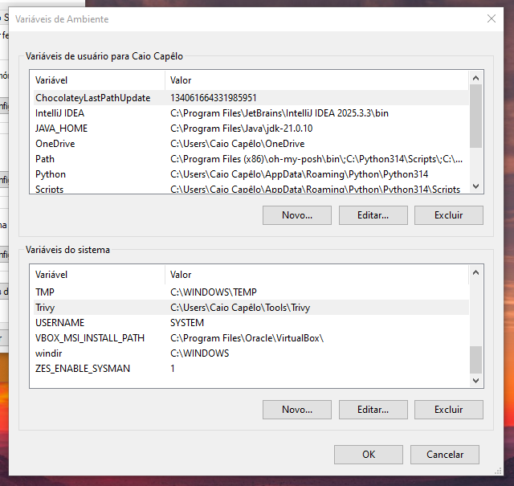
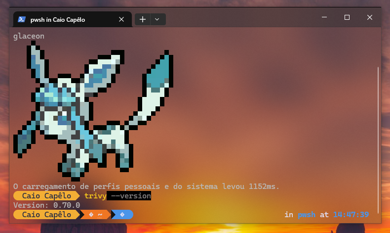

Trivy is a lightweight, fast security scanner used to find vulnerabilities (CVE) and misconfigurations (IaC) across code repositories, binary artifacts, container images, and Kubernetes clusters.

It's easy to integrate trivy with CI/CD (GitHub Actions, GitLab, etc), and It's important to add that trivy can generate reports! Check it's site for more info.

---**Using in Windows PoC** -----------------------------------------------------------------------

Step-by-step installation
- Download trivy_x.xx.x_windows-64bit.zip file from [releases page](https://github.com/aquasecurity/trivy/releases/).
- Unzip file and copy to any folder.
- Add trivy to the PATH system. 

Tests
- trivy in PATH system

- trivy --version
  

Scanning container image
- trivy image webgoat/webgoat:latest | less -S 

![[print-03.png]]

- trivy image --severity HIGH,CRITICAL webgoat/webgoat:latest | less -S

![[print-04.png]]

Scanning container image metadata
- trivy image --image-config-scanners misconfig,secret webgoat/webgoat:latest | less -S

![[print-05.png]]

Scanning local projects
- trivy fs C:/Users/"Caio Capêlo"/Repositories/api-ecommerce-tcg-pkm | less -S

![[print-06.png]]

Scanning git repositories
- trivy repo C:/Users/"Caio Capêlo"/Repositories/api-ecommerce-tcg-pkm | less -S

![[print-07.png]]

- trivy repo --scanners vuln,misconfig,secret https://github.com/capeloo/projeto-webapp-taverna.git | less -S

![[print-08.png|643]]

--------------------------------------------------------------------

---**Integrating with CI/CD pipeline using GitLab PoC**------------------------------------------

*Shift Left concept*

